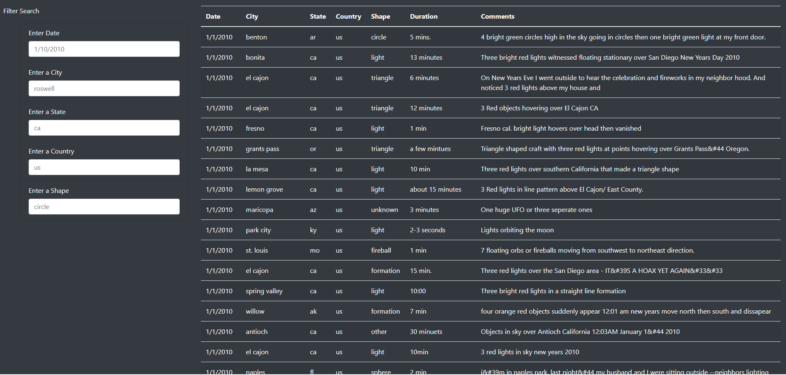
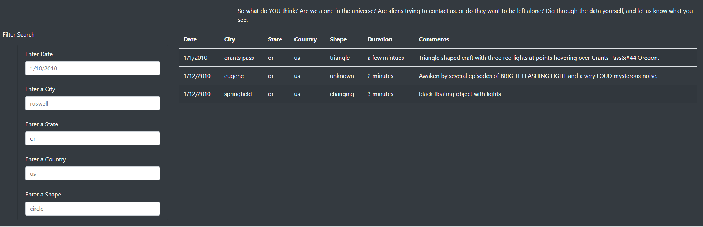
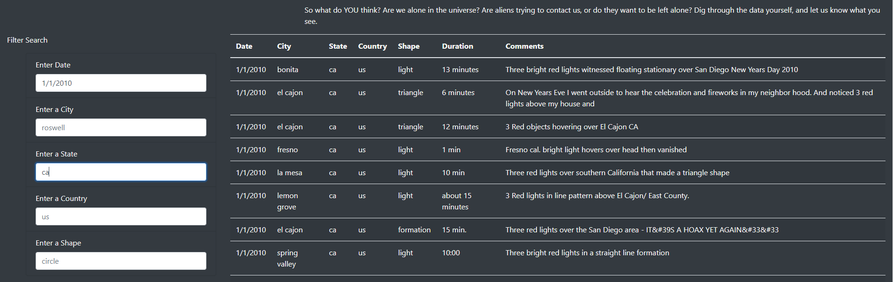

# UFO Sigtings -Challenge
UFO Sightings using JavaScript and html

## Overview of the Project:

### Project Background:

The purpose of this project is to visuaize the UFO sigtings data that is available in a JavaScript file.
- Create an interactive webpage that allows readers to view the UFO sightings data 
- Filter the data based on datetime

### Purpose:

Provide a more in-depth analysis of UFO sightings by allowing users to filter for multiple criteria at the same time. In addition to the date, add table filters for 
- city 
- state 
- country
- shape

## Resources:

Data Source: [data.js](static/js/data.js)  - A JavaScript file with UFO sighting information including date, city, state, country, shape.

Software: JavaScript (ECMA script or ES 2015 or ES6+), D3.js, html, Visual Studio Code

## Results:

Use JavaScript [app.js](static/js/app.js)to display data as a table and add filters to manipulate the data.  

Description of how someone might use the new webpage - walk-through of using the search criteria:

When the user first visits the web page (index.html), the user is presented with all of the UFO sightings information that is availalble on the data.js JavaScript file.  

Initial display of the data:

Since there is too much data displayed on the web page to make sense of it, the user can filter the data to see only the data he is interested in.  There are 5 different filters available on the webpage - datetime, city, state, country, shape. Each filter is already pre-filled with a sample text for users to use as an example. 

There are two different ways:

1) Use one of the available filters (datetime, city, state, country, shape) to filter the data.  

For example if the user filters the data by state (or), then all the data that matches the "or" will be displayed on the web page.

Filter by State:

2) Use combination of filters to filter the data.

For example the user can enter the value in the date cell ("1/1/2010) as well as the state cell ("CA). The web page will display all the data that matches these two criteria.

Filter by Date and State:

## Summary:

One drawback of this webpage:

- Currently to reset the filters, the user needs to refresh the page to reload the inital data. To make this webpage more user friendly, we can add a "clear all" button on the web page to clear all the filters.

Two additional recommendations for further development:

- Currently the user is required to enter (type in) a filter in the form.  This can be prone to errors as the user can misspell the word or might not know all the avialble options.  A better design would be to request the user to choose from availalbe options.

For example, in stead of requesting the user to enter the 2 digit state code, the webpage can show all the avaialble states to choose from using a drop-downbox.

For exaple, instead of asking the user to enter a shape, the webpage should display all the avaialble shapes as a checkbox. A User then simply has to "check" one of the shapes. 

